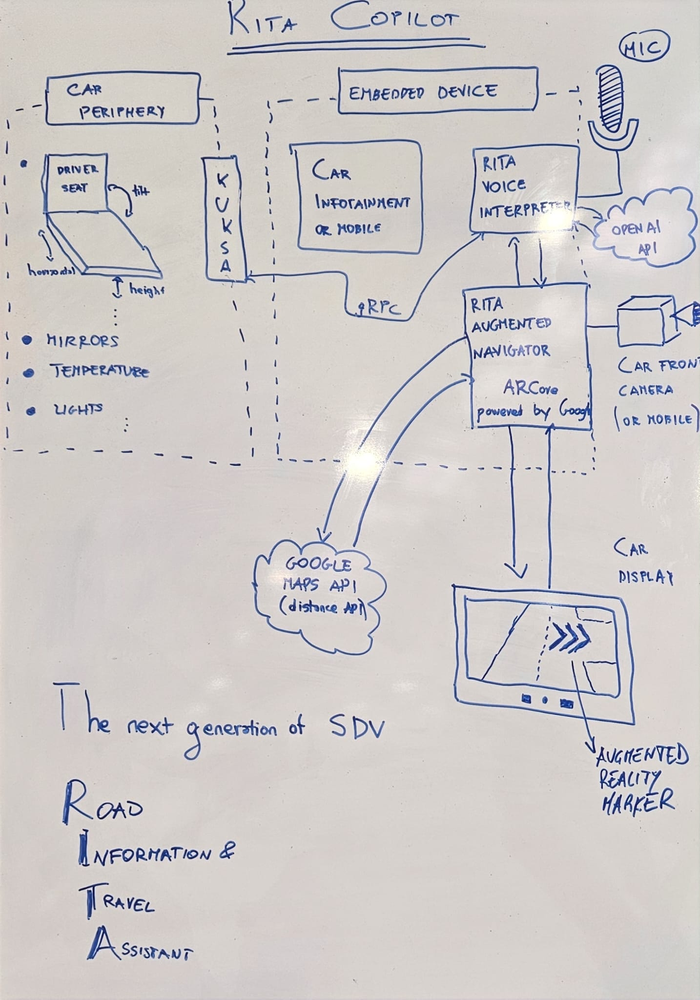

# RITA Copilot

RITA Copilot is a Road Information and Travel Assistant script that integrates various services for voice recognition, natural language processing, and text-to-speech. It acts as a copilot to assist drivers by providing real-time traffic updates, suggesting optimal routes, locating nearby services, offering mechanical advice, and facilitating emergency assistance when needed.

## Features

- **Voice Recognition:** Utilizes Azure's Speech SDK to convert spoken commands into text.
- **Natural Language Processing:** Employs OpenAI's GPT-4 model to classify and respond to user queries effectively.
- **Location Services:** Interacts with Google Maps APIs to obtain geolocation, search for nearby places, and fetch directions.
- **Vehicle Control:** Connects with Kuksa Seat Control to set up the driver's seat based on predefined profiles.
- **Text-to-Speech:** Utilizes Azure's Text to Speech service to convert textual responses into spoken words.

## Configuration

- Configure your personalized profiles in the `profiles` dictionary, mapping names to seat settings.
- Customize the system's introductory message and behavior in the `system_message` variable within the `chat_with_gpt` function.

## Usage

1. Record an audio command using a microphone (5 seconds duration by default).
2. The script will process the audio, convert it to text, and engage with the GPT-4 model for a categorized response.
3. The copilot will execute commands based on the identified category (welcome, route, service location, etc.).
4. Textual responses are converted to speech and played back.

## Dependencies

- Azure Speech SDK
- OpenAI GPT-4
- Google Maps APIs
- Kuksa Client
- PyAudio
- python-dotenv

## Augmented Reality Android App with ARCore

This Android application utilizes ARCore, Google's augmented reality platform, to create an immersive AR experience. The app allows users to interact with the real world by detecting surfaces and place 3D arrows in the real world to indicate where to turn when the navigator is active. It features real-time plane detection, point cloud visualization, and the ability to anchor virtual objects in the environment.

## System Architecture

